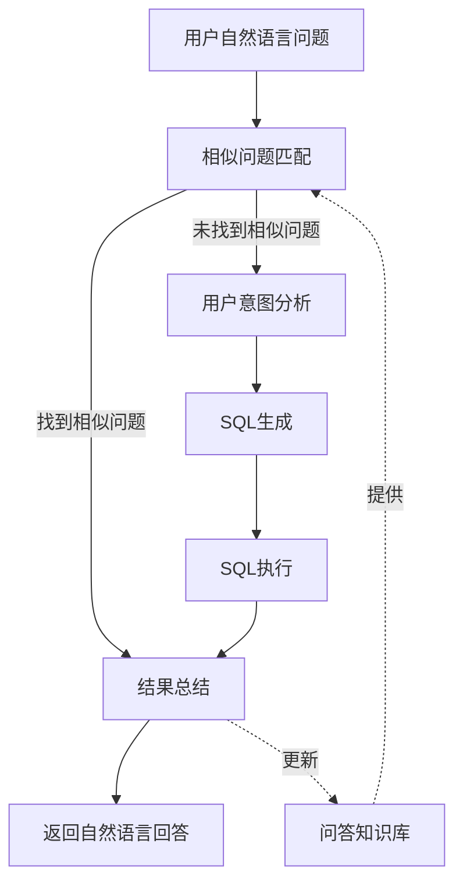

# 数据库查询代理系统

本目录包含数据库查询代理相关的模块，支持将自然语言查询转换为SQL并执行，然后解释结果。

## 文件说明

本系统包含以下主要文件：

- `db_query_agent_unified.py`：整合后的统一查询代理模块，合并了多个代理实现方式
- `querydbagent.py`：简单的React框架数据库查询代理
- `main.py`：基于多代理链式调用的实现
- `querydb_grap.py`：基于LangGraph的工作流实现
- `db_query_agent.py`：中间版本的数据库查询代理

## 主要功能

1. **相似问题匹配**：基于向量搜索查找已知问题，避免重复生成SQL
2. **用户意图分析**：分析用户自然语言查询，确定查询意图和相关表
3. **SQL生成**：基于意图和表结构生成SQL查询语句
4. **查询执行**：执行SQL并验证结果
5. **结果总结**：以自然语言形式总结SQL查询结果

## 架构流程



## 使用方法

统一代理模块提供了两种调用方式：

### 1. 使用React代理直接查询

```python
from agents.db_query_agent_unified import direct_query_database

query = "帮我查询生物类似药最多的原研药物"
result = direct_query_database(query, model_type="tongyi")
print(result["output"])
```

### 2. 使用工作流引擎查询

```python
from agents.db_query_agent_unified import workflow_query_database

query = "帮我查询生物类似药最多的原研药物"
result = workflow_query_database(query, model_type="openai", model_name="o3-mini")
print(result)
```

## 代码架构

主要类和组件：

- `DBQueryTools`：数据库查询工具集合
- `QuestionSimilaritySearcher`：问题相似度搜索器
- `DBQueryAgent`：基于React框架的数据库查询代理
- `WorkflowEngine`：工作流引擎，基于LangGraph构建查询流程

## 依赖组件

- `DatabaseManager`：数据库操作管理器
- `CacheManager`：缓存管理器
- `QAPairManager`：问答对管理器
- `LLMClient`：语言模型客户端 